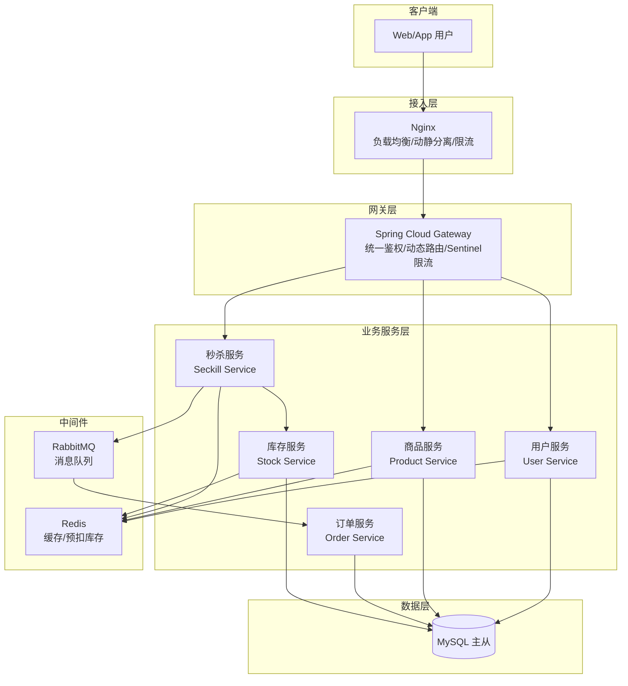
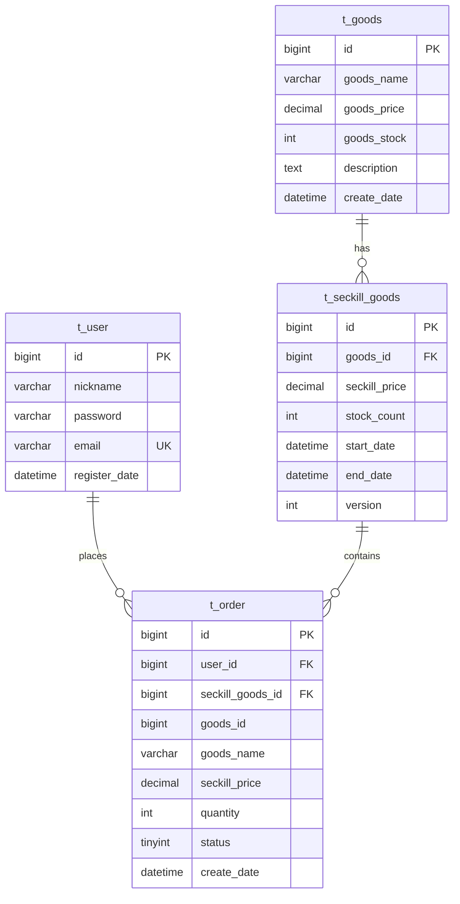

# 商品库存与秒杀系统设计文档

---

## 1. 项目概述
本系统是一个基于微服务架构的高并发秒杀系统。核心目标是在大流量冲击下，保证系统的**高可用性**和**数据一致性**（防止超卖），并提供流畅的用户体验。系统采用前后端分离、微服务拆分、缓存预扣库存、异步下单削峰等关键技术，确保秒杀活动期间系统的稳定性和数据准确性。

---

## 2. 系统架构图



**服务职责说明：**
- **用户服务**：用户注册、登录、分布式 Session 管理（基于 Spring Session + Redis）。
- **商品服务**：商品信息管理、秒杀商品列表查询、详情页缓存（Redis）。
- **秒杀服务**：秒杀核心入口，校验活动时间、用户重复下单、调用库存服务进行库存扣减。
- **订单服务**：创建订单、订单状态更新、订单查询。
- **库存服务**：管理商品总库存和秒杀库存，提供原子性的库存扣减接口（Redis Lua 脚本），同步更新数据库。
- **消息队列**：削峰填谷，将秒杀成功后的下单操作异步化，防止数据库瞬间压力过大。

---

## 3. 数据库设计（ER 图）



### 3.1 用户表（`t_user`）
| 字段名 | 类型 | 约束 | 说明 |
|--------|------|------|------|
| `id` | BigInt | PK，自增 | 用户ID |
| `nickname` | Varchar(50) | NOT NULL | 昵称 |
| `password` | Varchar(100) | NOT NULL | BCrypt加密后的密码 |
| `email` | Varchar(100) | UNIQUE | 邮箱 |
| `register_date` | DateTime | DEFAULT CURRENT_TIMESTAMP | 注册时间 |

### 3.2 商品表（`t_goods`）
| 字段名 | 类型 | 约束 | 说明 |
|--------|------|------|------|
| `id` | BigInt | PK，自增 | 商品ID |
| `goods_name` | Varchar(100) | NOT NULL | 商品名称 |
| `goods_price` | Decimal(10,2) | NOT NULL | 商品原价 |
| `goods_stock` | Integer | NOT NULL | 商品总库存（普通销售库存） |
| `description` | Text | | 商品描述 |
| `create_date` | DateTime | DEFAULT CURRENT_TIMESTAMP | 创建时间 |

### 3.3 秒杀商品表（`t_seckill_goods`）
| 字段名 | 类型 | 约束 | 说明 |
|--------|------|------|------|
| `id` | BigInt | PK，自增 | 秒杀活动ID |
| `goods_id` | BigInt | NOT NULL | 关联商品ID（外键） |
| `seckill_price` | Decimal(10,2) | NOT NULL | 秒杀价格 |
| `stock_count` | Integer | NOT NULL | 秒杀剩余库存 |
| `start_date` | DateTime | NOT NULL | 秒杀开始时间 |
| `end_date` | DateTime | NOT NULL | 秒杀结束时间 |
| `version` | Integer | DEFAULT 0 | 乐观锁版本号（用于数据库扣减） |

### 3.4 订单表（`t_order`）
| 字段名 | 类型 | 约束 | 说明 |
|--------|------|------|------|
| `id` | BigInt | PK，自增 | 订单ID |
| `user_id` | BigInt | NOT NULL | 用户ID |
| `seckill_goods_id` | BigInt | NOT NULL | 秒杀商品活动ID |
| `goods_id` | BigInt | NOT NULL | 商品ID（冗余，便于查询） |
| `goods_name` | Varchar(100) | NOT NULL | 商品名称（快照） |
| `seckill_price` | Decimal(10,2) | NOT NULL | 秒杀价格（快照） |
| `quantity` | Integer | NOT NULL | 购买数量（固定为1） |
| `status` | TinyInt | NOT NULL | 0-未支付，1-已支付，2-已取消 |
| `create_date` | DateTime | DEFAULT CURRENT_TIMESTAMP | 下单时间 |

**设计说明**：
- 订单表中冗余了商品名称和秒杀价格，防止商品信息变更后订单记录不准确。
- 使用 `seckill_goods_id` 关联秒杀活动，便于后续活动分析。

---

## 4. 核心接口 API（RESTful）

统一响应格式（`Result<T>`）：
```json
{
  "code": 200,
  "message": "success",
  "data": {}
}
```

| 状态码 | 含义 |
|--------|------|
| 200 | 成功 |
| 400 | 参数错误 |
| 401 | 未登录/Token失效 |
| 403 | 无权限 |
| 429 | 请求过于频繁（限流） |
| 500 | 服务器内部错误 |

### 4.1 用户服务（端口 8081）

| 方法 | 路径 | 描述 | 请求体示例 | 响应示例 |
|------|------|------|------------|----------|
| POST | `/api/user/register` | 用户注册 | `{"nickname":"张三","password":"123456","email":"zhangsan@example.com"}` | `{"code":200,"message":"注册成功"}` |
| POST | `/api/user/login` | 用户登录 | `{"email":"zhangsan@example.com","password":"123456"}` | `{"code":200,"data":"jwt_token"}` |
| GET | `/api/user/info` | 获取当前用户信息 | - | `{"code":200,"data":{"id":1,"nickname":"张三"}}` |

### 4.2 商品服务（端口 8082）

| 方法 | 路径 | 描述 | 请求体示例 | 响应示例 |
|------|------|------|------------|----------|
| GET | `/api/product/list` | 查询当前进行中的秒杀商品列表 | - | `{"code":200,"data":[{"id":1,"goodsName":"手机","seckillPrice":1999,"stockCount":100,"startDate":"2025-03-25 10:00:00","endDate":"2025-03-25 12:00:00"}]}` |
| GET | `/api/product/{id}` | 获取商品详情及秒杀倒计时 | - | `{"code":200,"data":{"id":1,"goodsName":"手机","goodsPrice":2999,"seckillPrice":1999,"stockCount":100,"startDate":"2025-03-25 10:00:00","remainingSeconds":120}}` |

### 4.3 秒杀服务（端口 8083）

| 方法 | 路径 | 描述 | 请求体示例 | 响应示例 |
|------|------|------|------------|----------|
| POST | `/api/seckill/do` | 执行秒杀请求 | `{"seckillGoodsId":1}` | `{"code":200,"message":"排队中","data":{"orderId":1001}}` 或 `{"code":500,"message":"库存不足"}` |

**说明**：秒杀成功后，返回排队状态，前端通过订单查询接口轮询最终结果。

### 4.4 订单服务（端口 8084）

| 方法 | 路径 | 描述 | 请求体示例 | 响应示例 |
|------|------|------|------------|----------|
| GET | `/api/order/{orderId}` | 查询订单状态 | - | `{"code":200,"data":{"orderId":1001,"status":1,"createDate":"2025-03-25 10:00:01"}}` |

### 4.5 库存服务（端口 8085）

| 方法 | 路径 | 描述 | 请求体示例 | 响应示例 |
|------|------|------|------------|----------|
| GET | `/api/stock/{seckillGoodsId}` | 查询秒杀剩余库存（Redis） | - | `{"code":200,"data":100}` |
| POST | `/api/stock/deduct` | 扣减库存（内部调用，原子性） | `{"seckillGoodsId":1}` | `{"code":200,"message":"扣减成功"}` 或 `{"code":500,"message":"库存不足"}` |

---

## 5. 秒杀核心流程

1. **客户端发起秒杀请求** → 携带 JWT Token 调用 `/api/seckill/do`。
2. **网关层（Spring Cloud Gateway）**：
  - 解析 Token，验证用户身份。
  - 使用 Sentinel 进行接口限流（如每秒最多处理 1000 个请求）。
3. **秒杀服务**：
  - 校验秒杀活动时间（是否开始/结束）。
  - 校验用户是否已秒杀过该商品（通过 Redis 存储用户购买记录，防止重复下单）。
  - 调用库存服务的 `/api/stock/deduct` 接口进行库存扣减（内部使用 Redis Lua 脚本原子性扣减）。
4. **库存服务**：
  - 执行 Lua 脚本：`redis.call('DECR', key)`，若返回值 ≥ 0 则扣减成功，否则返回失败。
  - 若扣减成功，将用户 ID 和秒杀商品 ID 发送到 RabbitMQ 消息队列，并返回成功；否则直接返回库存不足。
5. **订单服务（异步消费者）**：
  - 监听 RabbitMQ 队列，消费消息。
  - 生成订单记录插入 MySQL。
  - 更新数据库中的秒杀商品库存（`t_seckill_goods.stock_count`）使用乐观锁（version 字段），保证最终一致性。
  - 将订单状态存入 Redis 供前端轮询。
6. **客户端轮询**：前端定时调用 `/api/order/{orderId}` 获取订单最终结果，若支付成功则引导用户支付。

**异常处理**：
- 若数据库更新失败，通过重试机制保证最终一致性；必要时通过后台任务对账修复。
- 若消息队列消费失败，使用死信队列和人工介入机制。

---

## 6. 关键技术选型说明

| 类别 | 技术 | 版本 | 说明 |
|------|------|------|------|
| 后端框架 | Spring Boot | 3.2.x | 快速构建微服务，提供自动配置 |
| 微服务组件 | Spring Cloud Gateway | 4.1.x | 网关层路由、限流、鉴权 |
| 服务调用 | OpenFeign | 4.1.x | 声明式 HTTP 客户端，简化服务间调用 |
| ORM | MyBatis-Plus | 3.5.x | 简化数据库操作，支持乐观锁插件 |
| 数据库 | MySQL | 8.0 | 关系型数据库，用于持久化核心业务数据，主从复制 |
| 缓存 | Redis | 7.0 | 缓存热点数据（商品详情、用户购买记录、库存），利用 Lua 脚本保证原子性 |
| 消息队列 | RabbitMQ | 3.12 | 异步下单，削峰填谷，确保消息可靠投递 |
| 限流组件 | Sentinel | 1.8.x | 接口限流、熔断降级，与 Spring Cloud 整合 |
| 容器化 | Docker & Docker Compose | 20.10+ | 环境快速部署，保证开发、测试、生产环境一致 |
| 负载均衡 | Nginx | 1.24 | 反向代理、动静分离、负载均衡（轮询、权重、IP Hash） |
| 版本控制 | Git | - | 代码版本管理 |
| 压力测试 | JMeter | 5.5 | 性能测试工具，验证系统高并发能力 |

**补充说明**：
- **分布式 Session**：使用 Spring Session + Redis 实现，解决多服务实例间 Session 共享问题。
- **密码加密**：使用 BCrypt 加密存储，无需单独存储盐值字段。
- **缓存穿透/击穿/雪崩**：
  - 穿透：对查询不到的数据缓存空对象（过期时间较短）。
  - 击穿：使用互斥锁或逻辑过期，避免热点数据失效瞬间大量请求落库。
  - 雪崩：设置随机过期时间，分散缓存失效时间。
- **限流策略**：
  - Nginx 层：按 IP 限流（`limit_req`），防止恶意攻击。
  - 网关层：Sentinel 对 `/api/seckill/do` 接口进行 QPS 限流，保护后端服务。

---

## 7. 部署方案（容器化）

项目使用 Docker Compose 编排所有服务，包括：

- MySQL 主从（或单节点）
- Redis 集群（或单节点）
- RabbitMQ
- Nginx
- 各微服务实例（可水平扩展）

示例 `docker-compose.yml` 结构：

```yaml
version: '3'
services:
  mysql:
    image: mysql:8.0
    environment:
      MYSQL_ROOT_PASSWORD: 123456
    ports:
      - "3306:3306"
  redis:
    image: redis:7.0
    ports:
      - "6379:6379"
  rabbitmq:
    image: rabbitmq:3.12-management
    ports:
      - "5672:5672"
      - "15672:15672"
  user-service:
    build: ./user-service
    ports:
      - "8081:8081"
    depends_on:
      - mysql
      - redis
  # 其他服务类似...
  nginx:
    image: nginx:1.24
    volumes:
      - ./nginx/conf.d:/etc/nginx/conf.d
    ports:
      - "80:80"
    depends_on:
      - user-service
      - product-service
      - seckill-service
```

---

## 8. 后续扩展与优化

- **读写分离**：MySQL 主从复制，代码层面实现读操作走从库，写操作走主库。
- **搜索引擎**：引入 ElasticSearch 实现商品搜索功能，减轻数据库压力。
- **全链路监控**：集成 SkyWalking 或 Zipkin 进行分布式链路追踪，方便排查性能瓶颈。
- **CDN 加速**：将静态资源（图片、CSS、JS）托管到 CDN，进一步降低延迟。

```

